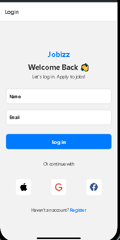

# rn-assignment4-11210750

# JobApp

JobApp is a React Native application that provides a login screen and a home screen displaying featured and popular job listings. Users can log in with their name and email, which are then displayed on the home screen. The home screen features two sections: Featured Jobs and Popular Jobs, each displaying job cards with details such as job title, location, and salary.

## Components

### `App.js`

- **Description**: Main entry point of the application that sets up navigation using React Navigation.
- **Usage**: Initializes the navigation container and stack navigator with two screens: `LoginScreen` and `HomeScreen`.

### `screens/LoginScreen.js`

- **Description**: Provides a login form where users can enter their email and name.
- **Usage**: Takes user input for email and name, and navigates to the `HomeScreen` with these details upon pressing the login button.

### `screens/HomeScreen.js`

- **Description**: Displays the user's email and name along with two sections for job listings.
- **Usage**: Receives the email and name from the login screen and displays them. Shows lists of featured and popular jobs using the `JobCard` component.

### `components/JobCard.js`

- **Description**: A functional component that displays job details.
- **Usage**: Takes job details (title, location, salary) as props and displays them in a styled card format.

## Screenshots

### Login Screen

### Home Screen

## Setup

### Prerequisites

- Node.js
- Expo CLI
